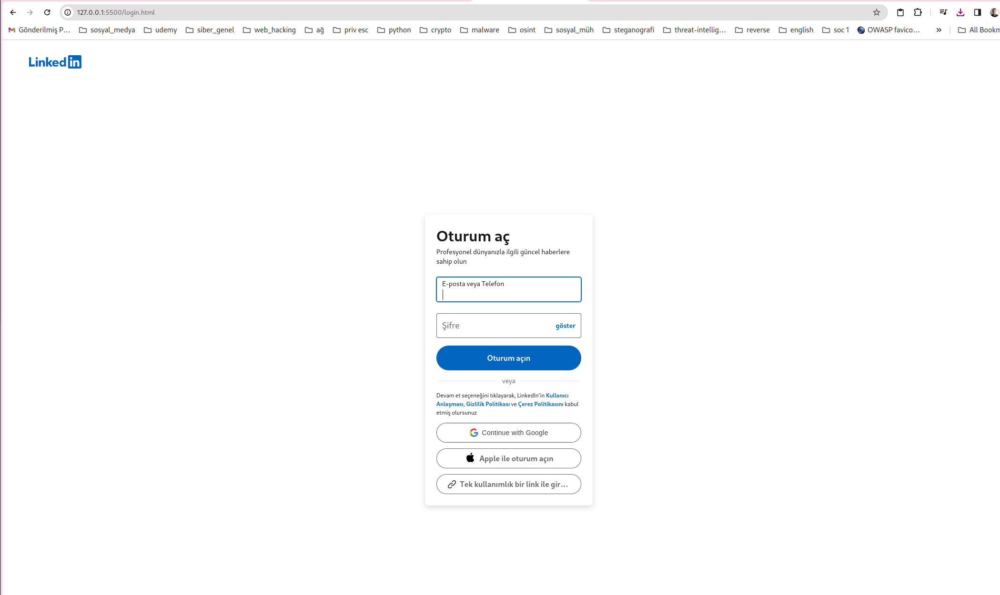

# insta_phishing :link:	

__*Linkedin Phishing Tool*__

************

# :inbox_tray: Installation :inbox_tray:

    git clone https://github.com/ozan-B/linkedin_phishing.git

****************

# :pencil: Description :pencil:

*  Araç kali linuxta kullanılmak için oluşturulmuştur .

- Url'i kurbana açtırmanız gerek , bunu qrcode veya bir phishing maili göndererek yapabilirsiniz artık bu sizin hayal gücünüze kalmış . 

- Daha sonra kurban , kullanıcı adı ve şifreyi girip Giriş Yap butonuna tıklayacak , tıkladıktan sonra kullanıcıya orijinal https://www.instangram.com  sitesi açılacak . Kullanıcı şifresini çalındığını değil yanlış şifre girdiğini düşünecek çünkü sayfa yenilenmiş gibi gözükecek . Bu kullanıcının aldatıldığını hemen anlamaması için bir önlem . 

- Kullanıcı bilgilerini grip butona tıkladığı anda username.txt dosyasına bilgiler kaydedilir.

- ip.txt dosyasına da agent ve ip bilgisi loglanır .

*************

# :camera_flash:Desktop Screenshot   :camera_flash:

-----
*********

## Bu yazılım yalnızca yasal ve etik amaçlar için kullanılmalıdır. Bu araç, izinsiz erişim, siber saldırı veya diğer yasa dışı faaliyetlerde kullanılmamalıdır. Kötü niyetli kullanım, yasal yaptırımlara, hukuki sorumluluklara ve ciddi sonuçlara neden olabilir. Bu nedenle, bu aracı yasal ve etik sınırlar içinde kullanmaya özen göstermelisiniz. Geliştirici veya dağıtıcı, bu aracın kötüye kullanımından doğacak herhangi bir sorumluluğu reddeder.

